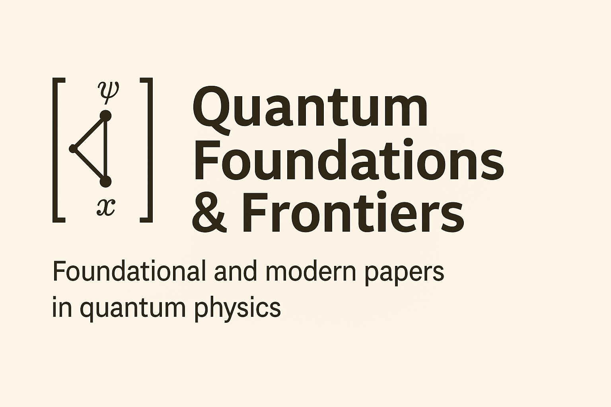

# 🧠 Quantum Foundations & Frontiers

A curated collection of foundational and modern papers in quantum physics, organized by topic and timeline.

📂 Each article includes:
- A structured reference with title, authors, and source link
- A summary to contextualize the contribution
- Tags and categories for thematic navigation

---

## 📜 Articles

### 🧠 Foundational
- [EPR Paradox (1935)](references/einstein-1935-epr-paradox.md)  
  _Einstein, Podolsky, Rosen – A challenge to the completeness of quantum mechanics._

- [Bell's Theorem (1964)](references/bell-1964-bells-theorem.md)  
  _Bell proves that no local hidden variable theory can reproduce quantum predictions._

### 💻 Quantum Computation
- [Shor's Algorithm (1994)](references/shor-1994-shors-algorithm.md)  
  _Breaks RSA with quantum factoring – a landmark in quantum algorithms._

---

## 🏷 Tags

Browse papers by concept in [`docs/tags.md`](docs/tags.md)

---

## 🌐 GitHub Pages version

📘 Explore the formatted site:  
[https://yourusername.github.io/quantum-foundations-frontiers/](https://yourusername.github.io/quantum-foundations-frontiers/)

> _"Understanding the history of quantum thought is key to shaping its future."_
